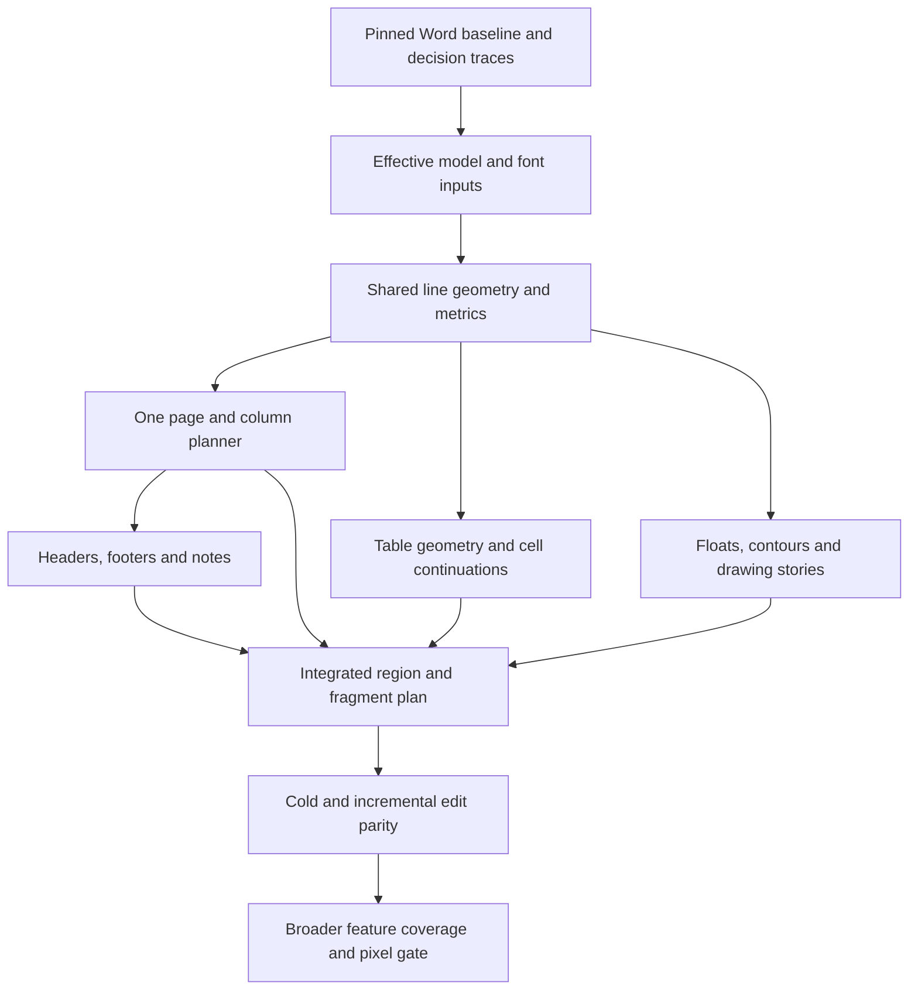

# What 1:1 Word fidelity would require

Eight specialist agents audited typography, pagination, tables, floating objects
and drawings, import semantics, verification, native layout contracts, and the
active architecture on 2026-10-06. The target is the installed **Mac Word
16.106.1, build 16.106.26021521, arm64**.

The evidence points to a substantial layout-engine program, with an incremental
route through the existing library. The critical path is a reproducible Word
oracle, complete effective formatting inputs, accurate line geometry, and one
authoritative page/column plan. Tables, floats, and notes then need richer
constraint and continuation models. Exact pixels add a separate painting problem.

The original source audit found concrete internal inconsistencies and unrepresented
features. That audit did not render new documents against Word. Subsequent work
captured controlled Word print PDFs and implemented several bounded corrections.
There is still no general fidelity score, complete-rewrite requirement, or
defensible completion date.

## Latest renderer verification on 2026-10-07

The continuation pass rendered **216 unique documents / 1,816 pages without a
render exception**. It removes drawing-text duplication, preserves merged grid
columns across pages, carries merged content through clipped windows, imports
and renders direct cell text direction, and corrects mixed page/paragraph
drawing origins. The prior 215 documents retain their page counts. This is a
stability sweep, not 216 Word comparisons.

Direct calls to the installed PTLS framework verify **5,502 bounded merged-cell
lookup and clipping cases**. Matching Word's locally bundled Calibri removes an
unwanted wrap in a new small corpus sample, but does not resolve floating-table
placement or the remaining 67-versus-66-page disagreement. The fonts were used
only for a local comparison; temporary copies were removed.

Validation passes **568 TypeScript unit tests with one skipped, 99 Rust tests,
11 Chrome browser regressions, the viewer typecheck, and the ESM/CJS/declaration
build**. The browser coverage includes changing merged-cell text and returning
to read-only mode. All 216 input hashes are unchanged. One additional download
is 198,119 bytes, and redundant artifacts were cleaned up. The overlap scanner's
one candidate is vertical text, visually checked as a horizontal-scan false
positive. Full details, visual comparisons, native-check scope, and remaining
gaps are in the
[continuation report](../output/playwright/word-continuations-20261007/REPORT.md).
These results do not establish 1:1 Word fidelity.

## Previous overlap verification on 2026-10-07

The reported Verdana table document now has readable automatic line spacing and
three pages at 50%, 100%, and 200% zoom. All table paragraph text is retained,
with no measured paragraph/cell overflow or overlapping table fragments. The
correction also covers fractional automatic spacing, explicit overflowing table
widths, list indentation and tabs, mixed-axis header anchors, and continued-row
flow. Read-only form values now render completely, and edits survive mode changes.

Pagination no longer reserves space for inactive first/even header variants or
behind-text header artwork. Implausible saved page counts cannot replace measured
layout, and the oscillation guard retains validated table row heights. A long
table reference improved from **42 to 32 viewer pages**, matching Word's count;
its measured rows stay within the physical pages. Geometry and painting still
differ. Another reference regressed from **66 to 67 pages** against Word's 66.

The latest public ESM build rendered **215 unique documents / 1,815 pages with
zero render exceptions**. This is a stability sweep, not 215 Word comparisons.
Three additional DOCXCorpus samples total **434,437 bytes** and have fresh Word
PDFs. Their counts agree at 2, 2, and 1, but merged table continuations, vertical
text, floating-table origins, footer placement, and text-box fallback duplication
remain visible gaps. All 197 original files and 18 retained samples match their
recorded hashes. Sampling occurred only during this work, with redundant
temporary artifacts cleaned up.

The final source passes **566 unit tests with one skipped, nine Chrome browser
tests, the viewer typecheck, and the ESM/CJS/declaration build**. This TypeScript
pass did not rerun the earlier Rust/native probes or standalone package harness.
Current evidence, before/after images, all 42 changed corpus page counts, input
integrity, source hashes, and unresolved cases are in the
[overlap and pagination report](../output/playwright/word-overlap-20261007/REPORT.md).
These results do not establish 1:1 Word fidelity.

## Earlier verification on 2026-10-07

The earlier public ESM build rendered **212 unique documents, totaling 1,856
pages, without a render exception**: 197 from the existing testing folder, nine
small public repository samples, and six documents from
[DOCXCorpus](https://docxcorp.us/download). The six DOCXCorpus downloads total
**1,262,584 bytes**. Only 20 metadata rows were requested, in two batches; the
complete dataset was not downloaded. This is a rendering-stability result, not
212 Word comparisons.

Four corrections are integrated in this source epoch:

- Stop imported-document measurement feedback when page counts oscillate, and
  reset the guard when its document or measurement context changes. Two corpus
  documents previously exhausted React's update limit and displayed no pages.
- Honor explicit page width and height independently of the print-orientation
  flag. Word's document layout and print-paper orientation can disagree when
  that flag conflicts with the dimensions.
- Apply table run formatting below paragraph, character, and direct run
  formatting. Cell contents are parsed once after their conditional table style
  is known; outer table formatting no longer overwrites nested-table runs.
- Preserve `w:sz` and `w:szCs` independently through import, layout, painting,
  editing, and export. A complex-script size must not override inherited Latin
  text sizing. Mixed-script runs can now split by size as well as font family.

There are **18 fresh Word print PDFs**, including two controlled documents and
four explicitly identified input variants. Two PDFs with inconsistent print
orientation are cropped and are excluded as pixel references. A TOC document
now agrees with Word at **66 pages**, including the checked entry on page 3.
Other comparisons still differ: **20 versus 19**, **42 versus 32**, and **1
versus 2** viewer/Word pages. These references also expose baseline, table-row,
numbering, and image-rendering differences. There is no current pixel-parity
claim. The report distinguishes unchanged inputs, ZIP-trailer-only repairs,
and an orientation-only control.

That source snapshot passed **556 existing unit checks with one skipped, 97 Rust
checks, five existing Chrome checks, viewer and playground typechecks, and 62
public ESM/CJS import/export assertions**. WASM and both viewer package formats
were rebuilt. A public font-refresh control repaginates from two to three pages
and restores exactly to two after the temporary face is removed. Native probes
against the hash-pinned installed framework verify a further **2,004 bounded
line-metric cases and 1,003 first-row clipping cases**; they do not identify the
active Word font provider or document-layout unit conversion.

Earlier provenance, page-count changes, font controls, source/build hashes,
and retained local evidence are in the
[dated comparison report](../output/playwright/word-fidelity-20261007/REPORT.md).
The `tmp/word-*` paths in the historical record below are **absent from this
checkout**. Their reported results have not been recaptured here and must not
be treated as current executable evidence.

Subsequent implementation connected verified native arithmetic and line-fit
helpers to the active viewer, added per-line browser metrics and shared
widow/orphan split constraints, propagated document default tabs, preserved
selected settings, and corrected measured font advances and exact line spacing.
Table row restrictions and cell clipping now share a bounded geometry contract.
Later integration preserves fractional fixed-table grids and row omissions,
uses physical grid positions for column edits and rectangular selection, and
measures empty paragraphs from their effective paragraph-mark formatting.
Eligible ordinary text paragraphs, including mixed formatting, and direct table cells now reuse planned lines
for both paint and editing, with bounded layout caches keyed by complete text,
formatting, document settings and font revision.
See [the native investigation and integration record](word-native-layout-research.md#implemented-browser-integration)
for the implemented scope and validation. The parity gates below remain open.

## Define the claim

Start with one declared rendering profile: Word build and binary identity,
macOS, actual font files and fallback faces, compatibility settings, locale,
field/revision view, PDF export choices, browser/dependency versions, and device
scale. Windows Word and web conversion require independent results.

There are three different gates:

1. **Content and layout:** identical text membership and source offsets on each
   line/page, table/cell continuations, region ownership, baselines, spacing,
   object frames, clipping, and page geometry. Exact recovered units can be
   compared exactly. PDF/DOM observations need recorded precision and
   repeatability; a tolerance is an explicit approximation.
2. **Painting:** identical decoded pixels on the same unresized raster grid.
   Matching geometry does not establish matching glyph antialiasing, borders,
   drawing effects, color handling, or image decoding. A tolerant image score
   establishes visual similarity rather than literal pixel identity.
3. **Editing:** incremental layout equals a cold layout of the same document;
   exported edited bytes render with the same layout in Word; export/reimport
   and undo/redo preserve the result.

A finite corpus can establish exact agreement for its cases and selected feature
profile. It cannot prove every possible DOCX behaves identically. Expand the
claim by adding independent rule and interaction coverage.

## Historical evidence through 2026-10-06

The earlier [v4 validation snapshot](/Users/andrewluo/react-docx/tmp/word-fidelity-implementation/validation-summary-v4.json)
recorded the 0.10.0 integration. The historical [v9 comparison](/Users/andrewluo/react-docx/tmp/word-parity-native/oracle/integration-v9-comparison.md)
and [machine-readable results](/Users/andrewluo/react-docx/tmp/word-parity-native/oracle/integration-v9-summary.json)
bound that source epoch to three unchanged Word references. The following
numbers describe those earlier runs; their local artifacts are unavailable in
the current checkout. Resting images and live interaction checks were recorded
separately.

- **Three frozen Word print PDF references cover four pages.** All four v9
  browser pages pass page-count, page-dimension, input-integrity, and measured
  renderer-metadata checks; all four fail exact pixel comparison. The 39
  controlled line texts match, including the ordinary paragraph's **21 + 9**
  page split. Every v9 PNG and pixel metric is identical to v6. Equal counts and
  text do not establish complete geometry.
- The ordinary first browser baselines are approximately **46pt versus Word's
  46.56pt**. Mixed-font browser baselines remain 1.51–1.76pt above their Word
  counterparts. Exact rows retain **four 17.6px advances**, and small/large runs
  now share their painted baseline. Current physical-DPR-1.5 minimum rows are
  **36.6667px**, with measured advance 27.499992pt versus Word's 27.6pt. The older
  37px/74px probe lacks complete profile/source/WASM provenance and is historical.
- Current table DOM first-row extents are **48/48/48/24.500001pt** for
  exact/minimum/omitted/auto, versus Word border-center measurements of
  **48/48.48/48.72/24.48pt**. Browser borders are approximately 0.5pt versus Word's
  0.48pt. DOM outer rectangles and PDF border centers remain different observables.
  The guarded v6 renderer capture passes 81 assertions across 15 labeled tables
  and 99 boundary assertions across 17 read-only and six editable cell scenarios.
  Both former fractional cell-wrap failures now use the planned two-line
  membership, with the same thresholds and tolerances. Seven native selection
  and caret cases pass, including body/cell drag-and-copy with no model mutation.
  These additional cases have no corresponding Word reference. Evidence:
  [v6 renderer qualification](/Users/andrewluo/react-docx/tmp/word-fidelity-fleet/fractional/v6/browser-boundary-qualification.json),
  [native selection](/Users/andrewluo/react-docx/tmp/word-fidelity-fleet/fractional/v6/browser-selection-qualification.json).
- Tagged table/cell widths, alignment, bidi placement, legacy width edits, and
  inherited clears are represented through import, cloning, active resolution,
  and export. Direct property-owner lookup isolates current formatting from
  revision history and nested tables. Header/footer tables now use the text
  region even when a drawing requires a page-wide host. Fractional fixed-table
  widths now survive active grid resolution, cell spans, row omissions, placement
  and line-width cache keys. Explicit fixed widths can overflow their containing
  region. The ordered solver awaits Word qualification; full Word autofit and
  nested-percentage behavior remain open.
- Positioned text uses actual DOM struts and zoom-aware fragment baselines;
  font/display-profile changes invalidate metric caches. Eight measured viewer
  paint-zoom combinations preserve logical row geometry. Separately, **24 live
  caret/double-click scenarios pass** at viewer 50/100/200% with external CSS zoom
  1/1.25, including fresh inactive-session selection. This covers the controlled
  three-word/tab source in installed Chrome; multiline zoom and OS-native IME
  remain unqualified. Evidence: [strut qualification](/Users/andrewluo/react-docx/tmp/word-parity-native/typography/exact-baseline-qualification.md),
  [zoom selection](/Users/andrewluo/react-docx/tmp/word-fidelity-fleet/zoom-caret-browser-qualification.json).
- The v4 snapshot passes **556 unit checks with one skipped, 97 Rust checks,
  46 oracle contracts, five existing Chrome checks, nine typecheck projects,
  eight package builds plus WASM, and 93 packaged ESM checks**: 33 table checks,
  16 settings/mark checks and 44 line/grid/ownership checks. Public CJS roundtrip,
  18 controller cases, 15 public export/reimport loops and seven empty-style
  controller cases also pass. These establish bounded integration behavior.
- The later [v7 interaction integration](/Users/andrewluo/react-docx/tmp/word-fidelity-implementation/validation-summary-v7.json) passes **556 unit checks with one skipped,
  five existing Chrome checks, nine typecheck projects, 93 packaged ESM checks
  and the CJS roundtrip** after rebuilding the viewer. Fresh toolbar selections
  retain their range through the shared input/native rendering transition.
  Eleven source-stable context-menu and primary-selection controls also pass,
  including Copy, Cut, undo, caret placement and the existing table menu.
  V5/V6 candidate failures remain archived. V7 changes selection-event ownership
  without altering layout; the later v9 Word recapture has its own source epoch.
- The [v8 thumbnail correction](/Users/andrewluo/react-docx/tmp/word-fidelity-implementation/validation-summary-v8.json) includes font-metric revision in page
  content keys. In the controlled browser font-load probe, attached and explicitly
  requested previews refresh automatically and match a forced render. Independent
  thumbnail text painting remains an approximation. The focused integration
  passes 33 existing checks, the existing Chrome thumbnail check, viewer and
  playground typechecks, and the viewer build.
- The [v9 mixed-text integration](/Users/andrewluo/react-docx/tmp/word-fidelity-implementation/validation-summary-v9.json) shares participating-run row heights,
  lexical breaks and source offsets across ordinary body/cell planning, paint and
  editing. Manual breaks preserve LF/CRLF source positions and terminal empty
  rows. Formatted replacement retains its style, page slices have one active
  input, and caret affinity distinguishes both visual positions at a soft wrap.
  The final source passes **556 unit checks with one skipped, two typechecks,
  five existing Chrome checks, 93 packaged ESM checks and CJS roundtrip**.
  Separately guarded live checks pass **46 mixed-format controls and 31
  pagination, navigation and read-only controls**; 1,036 browser planner/geometry
  assertions pass. These qualify the declared cases, including the previously
  failing Down/Home/End page boundary, rather than complete editing parity.
  [Mixed-format report](/Users/andrewluo/react-docx/tmp/word-fidelity-fleet/mixed-v9/READY-4E-QUALIFICATION.md),
  [page-boundary report](/Users/andrewluo/react-docx/tmp/word-fidelity-fleet/manual-v9/READY-4e-REPORT.md).
- The [v10 serializer correction](/Users/andrewluo/react-docx/tmp/word-fidelity-implementation/validation-summary-v10.json)
  preserves explicit zero table/cell margins when XML is generated or
  regenerated. The rebuilt WASM and both public package formats pass **78
  export/reimport paths**, 97 existing Rust checks and 34 focused unit checks.
  This prevents zero overrides from disappearing into inherited spacing.
  Original table XML retains its existing authority until regeneration.
- Fractional section dimensions and margins now reach ordinary unmeasured page
  capacity and virtual page spacing. Explicit mixed page/local object anchors
  resolve their page axis correctly, and live textboxes no longer inherit the
  body paragraph's first-line indent. Measured reconciliation and unsupported
  anchor semantics remain separate from these source-coordinate corrections.
  The integrated build passes 556 existing unit checks, two TypeScript projects,
  five Chrome regressions and 80 focused anchor/indent/import checks. Its four
  controlled browser reference images are unchanged from v9; Word pixel and
  baseline parity remain unachieved.
- Six real documents now have immutable v9 browser captures and complete plans
  totaling **96 pages**, with **16 leading page screenshots**. The local
  corpus's 109 inspected PDFs are LibreOffice output; fresh Word references are
  still needed before claiming a corpus pagination or pixel match.
- Native validation covers 15,749 arithmetic/synthetic-fit cases, a distinct
  3,003-case generic geometry branch, 1,003 Word-story geometry cases and 5,008
  bottom-border scaling cases. Story dispatch is conditional; the tested
  obstacle-free Word path uses equal available-height limits and a different
  suppression/overhang policy. See the [fitter contract](/Users/andrewluo/react-docx/tmp/word-parity-native/paragraphs/native-fitter-active-contract.md).
  Static print recovery conditionally selects **294912 formatting units/inch**;
  presentation uses prepared cached axes that later setup can change. A
  print-device default of 300 does not prove the selected presentation scale.
  Effective provider, flags and cumulative origin remain unqualified. See the
  [presentation follow-up](/Users/andrewluo/react-docx/tmp/word-parity-native/metrics/PRESENTATION-AVAILABILITY-AND-RECORD-ORIGIN.md).
- The Word captures use macOS print-to-PDF. Embedded paint data matches the
  inspected bundled Arial 6.80i and Calibri 6.20 subsets; this narrows face
  identity without selecting the formatting provider or browser fallback.
  See the [font comparison](/Users/andrewluo/react-docx/tmp/word-parity-native/typography/font-identity/REPORT.md).
  A later [browser audit](/Users/andrewluo/react-docx/tmp/word-parity-native/typography/browser-font-probe/REPORT.md)
  reports platform ArialMT for all 84 examined leaves and associates Chrome's
  exposed font tables with system Arial 5.01.2x. Controlled complete-font swaps
  produce identical browser metrics and fixed-origin sample rasters, so this
  font difference does not explain the measured baseline residual.
  The [real-document audit](/Users/andrewluo/react-docx/tmp/word-parity-native/typography/corpus-platform-fonts/REPORT.md)
  does find missing Calibri faces: sampled regular/bold text uses Helvetica,
  while embedded Ubuntu faces are employed correctly. This is a browser font
  mismatch that the controlled Arial result does not cover.
  Comparison uses matched input
  raster dimensions without resampling, but NumPy 2.3.5 differs from pinned
  2.5.1, so the results remain research evidence. Earlier emulated/physical/v2
  captures retain their own source epochs. Three further Word captures await
  manual Mac unlock; no general fidelity score or private-corpus result is claimed.

## Highest-impact findings

This table distinguishes implemented corrections from the remaining parity
requirements. Source observations alone do not quantify a rendered mismatch.

| Area | Current verified scope | Remaining capability |
| --- | --- | --- |
| Active ownership | `DocxEditorViewer` remains the owning paginator in `editor.tsx`; eligible ordinary body/cell paragraphs, including mixed formatting, share decided lines and heights with paint and editing. The legacy viewer uses the separate `layoutDocument` path. Existing snapshot/canvas scaffolding is not a complete authoritative renderer. | Extend the shared plan to unsupported text/regions and thumbnails, with complete incremental edit qualification. |
| Measurement versus paint | Fractional text inputs and corrected Chromium advances feed preparation. Positioned text uses DOM struts and zoom-aware paint baselines; font/display-profile changes invalidate caches. | Verify actual fallback faces, script/language/direction, shaping features, and all remaining paint paths. |
| Vertical metrics | Pretext carries per-row ascent/descent/height. Exact rows retain 17.6px advance; current physical-DPR-1.5 minimum rows are 36.6667px versus Word's 36.8px. Planned and painted browser baselines agree across the qualified zoom sweep. | Word baseline partition, natural metrics, before/after ownership, cumulative phase, and ink painting remain distinct from the browser contract. |
| Tabs | Document default intervals now reach body, nested tables, section/global headers and footers, notes, numbering, measurements, and cache signatures through immutable model-scoped views. Fractional and explicit positions are retained; prefix advances use corrected canvas measurement. The controlled 1440-twip browser case places following runs at 96px and 192px. | Verify wrapped-line origins, leader/alignment behavior, checkbox policy, and tab geometry against Word rather than only source/SSR/browser probes. |
| Break rules | Page and column splitters use a shared minimum-line constraint. The bounded positive-height, zero-suppression/equal-limit fit case is integrated; the controlled baseline matches 21 + 9 page membership. Saved-count and measured-height fallback paths still exist. | Qualify story dispatch and actual suppression/overhang policy, complete keep/spacing rules and diagnostics that expose fallback use. |
| Columns and notes | Unequal-column planning and render-time splitting remain separate. Notes still use estimated reserves; endnotes append to the last page. | Concrete flow tracks, blank/parity pages, formatted note stories, and coupled body/note continuation. |
| Tables | Row restrictions/padding/clipping, tagged widths, alignment/bidi placement, legacy edits and inherited clears share active contracts. Fixed grids, cell spans, row omissions and horizontal float placement retain fractions. Column edits and rectangular selection use physical grid positions. | Ordered fixed constraints await Word qualification. Native autofit, nested percentages, RTL ordering, collapsed borders, merges/continuation and repeated headers remain open. |
| Floats and objects | Rectangular tight/through exclusions, incomplete anchor policies, reduced text-box stories, group order, and missing equation layout remain audit findings. | Contours, resolved anchors, collision/restart state, and complete object stories for each claimed profile. |
| Import and compatibility | Explicit compatibility mode, six line-spacing switches, document tabs and paragraph text-alignment ownership survive import, cloning and export. Empty paragraph marks supply line/caret metrics; split/merge operations retain the appropriate ending. | Text-alignment and compatibility-switch rendering, other settings, script-specific inputs, and alternate/deleted paragraph-ending paths remain unqualified. Preservation does not establish behavioral support. |
| Native mapping | Fit limits, fixed advance, metric projection, spacing producers and a conditional 294912-to-device print profile are recovered on specific paths. | Qualify effective imported flags/provider, fallback gates and cumulative origin before selecting portable Word metrics. |

Useful owning pointers:

- [Active viewer and pagination](/Users/andrewluo/react-docx/packages/react-viewer/src/editor.tsx),
  [line metrics](/Users/andrewluo/react-docx/packages/layout-engine/src/line-metrics.ts),
  [paragraph constraints](/Users/andrewluo/react-docx/packages/layout-engine/src/paragraph-breaks.ts).
- [Pretext row geometry](/Users/andrewluo/react-docx/packages/react-viewer/src/pretext-layout.ts),
  [font advance adapter](/Users/andrewluo/react-docx/packages/react-viewer/src/font-advances.ts),
  [document tab context](/Users/andrewluo/react-docx/packages/react-viewer/src/tab-layout-context.ts).
- [Table geometry](/Users/andrewluo/react-docx/packages/layout-engine/src/table-geometry.ts),
  [table width/placement](/Users/andrewluo/react-docx/packages/layout-engine/src/table-width.ts),
  [settings parsing](/Users/andrewluo/react-docx/crates/docx-core/src/parse/metadata.rs),
  [settings serialization](/Users/andrewluo/react-docx/crates/docx-core/src/serialize.rs),
  [document model](/Users/andrewluo/react-docx/packages/doc-model/src/types.ts).

## Implementation sequence and acceptance gates

| Stage | Work | Scope | Gate |
| --- | --- | --- | --- |
| 0. Reproducible baseline | Pin the target; reconcile dependencies; capture immutable Word PDFs; add source-linked line/object geometry and first-divergence traces. | Bounded tooling work, required before estimating the rest. | Repeated captures establish repeatability; originals, cache-hint-free copies, and edited bytes each have their own reference. A baseline reports actual disagreements. |
| 1. Effective inputs | Preserve compatibility, default tabs, script-specific typography, table width kinds, anchor policies, and formatting provenance. Correct path-specific measurement/paint input differences. | A series of bounded changes plus a growing semantic contract. | Controlled sources retain their distinct settings and use the same resolved inputs for measurement and paint; direct/inherited/default formatting can be traced. |
| 2. Authoritative line geometry | Introduce source/cluster mapping, resolved font faces, advances, breaks, baseline/ascent/descent, spacing, and conversion boundaries. Extract live layout incrementally. | Large foundational workstream. | Simple and mixed-run paragraphs match Word's line boundaries and baselines; planned geometry equals painted geometry across ordinary, split, and wrapped paths. |
| 3. Paragraph/page rules | Implement verified spacing, keeps, widow/orphan, vertical-fit limits, section/column tracks, balancing, and parity pages in one evaluator. | Substantial algorithm work, with independently bounded rules. | Boundary probes agree on the first accepted/rejected break, page/column source ranges, and region geometry without saved-count forcing. |
| 4. Interacting stories and objects | Build table width/span solvers and semantic cell fragments; contour/anchor placement; header/footer selection; footnote rejection/continuation and paginated endnotes. | Several large subsystems that can be researched in parallel. | Isolated feature probes and combined cases agree on geometry, continuations, page ownership, and deterministic reflow. |
| 5. Editable convergence | Route paint, caret/hit testing, thumbnails, and edits through the same plan; add flow checkpoints and precise invalidation; preserve public APIs. | Large correctness/performance workstream. | Incremental and cold layout agree after text/style/table/object/note/section changes, undo/redo, font loading, and virtualization. Word matches exact edited/exported bytes. |
| 6. Paint and coverage | Complete drawings/text-box stories/equations and other claimed features; characterize raster differences and broaden font/script/compatibility coverage. | Multiple further projects, dependent on the chosen scope. | Each advertised profile passes its geometry and independently defined pixel gate. |

Stages overlap. Import settings and typography can proceed together; tables,
floats, and note rule discovery can proceed while the line contract is built.
Their production integration needs shared line metrics and region/continuation
state. Native investigation follows observed first divergences throughout.

## Next qualification milestone

The first three controlled references and initial corrections are in place.
Continue through the existing harness: repeat captures to establish repeatability,
record extractor precision/quantization, and pin the actual selected-font profile.
Then extend stability checks across the controlled feature families and recapture
the five legacy sources with full provenance. Add an initial **24 proposed
boundary variants**: fitting, threshold, and overflowing versions across eight
families—width/rounding, mixed line metrics, line spacing, page-boundary spacing,
keep chains, widow/orphan, table splitting/repeats, and section/region capacity.
The actual thresholds must come from Word measurements.

For each case, collect effective properties, resolved fonts, source offsets,
line/page/column membership, baselines, available geometry, object/table frames,
and the viewer's break reasons. Word PDFs supply observed boundaries and geometry;
internal Word break reasons need recovered native evidence, with any explanation
labeled as verified or inferred. Run original and hint-free variants with separate
frozen Word references. Add an edit at a boundary, export, capture Word on those exact bytes,
and compare fresh import and undo/redo states.

Continue implementation from the first remaining isolated mismatch. Sweep width and height
in one-twip increments, vary fractional size and character spacing separately,
and compare Word output with DOM bounds, canvas metrics, Pretext fragments, and
predicted segments. This connects the native findings to an observable decision
and determines whether the first error is import, shaping, measurement, a break
constraint, region capacity, or painting.

The controlled ordinary-text membership result is a first milestone, not the
complete ordinary-text gate. That gate also needs repeatability, a declared font
profile, source-aligned boundary sweeps, precise baseline/region agreement, and
edit/export checks under the recorded measurement precision. Complex features
graduate through their own independent gates.

## Architecture and effort decisions

Preserve Rust/WASM import and serialization, the editable model/controller,
transactions, and React interaction. Continue extracting the active TypeScript
planner and promote one shared immutable layout result. Keep legacy APIs
compatible. Retire approximations as verified replacements earn their gates.

Browser shaping is a candidate provider for an initially pinned profile. If
controlled advances/fallback/complex-script probes reveal persistent differences,
evaluate a portable font resolver/shaper through the same contract. A Rust/WASM
backend is a later implementation and performance decision; neither switching
languages nor switching to canvas establishes Word correctness.

Small input corrections and diagnostics are bounded work. Resolved typography,
authoritative region layout, table continuations, float/note reflow, and editable
convergence are substantial subsystems. General Office drawings and literal
cross-environment pixel identity add further scope. A calendar budget should
follow the first measured corpus and explicit feature profile; this audit
provides no reliable current percentage or finish date.

## Fleet reports and evidence

The original audit notes are source snapshots in the Git-ignored
`tmp/word-fidelity-fleet` directory. Their historical gaps and line numbers may
predate the implemented corrections recorded above:

- [Typography](/Users/andrewluo/react-docx/tmp/word-fidelity-fleet/typography.md)
- [Pagination](/Users/andrewluo/react-docx/tmp/word-fidelity-fleet/pagination.md)
- [Tables](/Users/andrewluo/react-docx/tmp/word-fidelity-fleet/tables.md)
- [Floats and drawings](/Users/andrewluo/react-docx/tmp/word-fidelity-fleet/floats_shapes.md)
- [Import and compatibility](/Users/andrewluo/react-docx/tmp/word-fidelity-fleet/semantics_compat.md)
- [Word oracle and verification](/Users/andrewluo/react-docx/tmp/word-fidelity-fleet/oracle_verification.md)
- [Native contract mapping](/Users/andrewluo/react-docx/tmp/word-fidelity-fleet/native_mapping.md)
- [Architecture](/Users/andrewluo/react-docx/tmp/word-fidelity-fleet/architecture.md)

The [native investigation](/Users/andrewluo/react-docx/docs/word-native-layout-research.md)
and [existing harness documentation](/Users/andrewluo/react-docx/docs/word-fidelity-harness.md)
provide the supporting binary and comparison contracts. Later implementation
notes and controlled evidence are in `tmp/word-parity-native/` and
`tmp/word-fidelity-implementation/`; production changes remain scoped to the
verified integrations described above. Final integrated validation belongs to
its recorded source snapshot, not the earlier audit counts.
